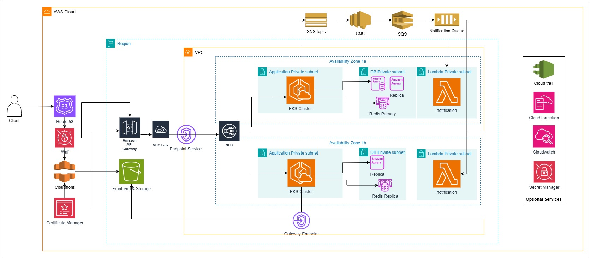

### 1. Introduce
- I assume that the system is not running in multiple regions and does not include monitoring and logging in the requirements.
- I assume that all the services within the system’s VPC, which we manage ourselves, are evenly distributed across two Availability Zones to avoid incurring cross-AZ data transfer costs.
- The backend services will be deployed using a microservices architecture instead of a monolithic one to minimize the impact if a single service fails, preventing it from affecting other services. Furthermore, by separating the services according to specific functionalities, you can precisely allocate and optimize resources for each service, leading to better efficiency and cost savings.

### 2. Architecture

### 3. ServicesServices
1. Amazon EKS (Elastic Kubernetes Service)
- Host
- By leveraging Kubernetes’ strengths such as flexible scalability, self-healing, resource partitioning, and cross-platform/environment portability through manifest files (making it easy to switch to a different platform when needed) 
- Meanwhile, with AWS EKS, the control plane is managed by AWS, so there’s no need to handle installation, maintenance, or patching, thus reducing operational overhead. It integrates seamlessly with other AWS services and supports automatic scaling of node groups via Cluster Autoscaler or Karpenter, ensuring a resilient, scalable, and cost-effective infrastructure.
2. Amazon RDS (Relational Database Service)
- Stores data. 
- Provides Multi-AZ capability, automatically switches over to the standby instance in a different AZ, making it the new primary when a failure occurs, ensuring resilience to failures.
3. Amazon ElastiCache for Redis
- Create a caching layer to accelerate data access and reduce the load on RDS. 
- An AWS-managed service that reduces operational overhead and provides failover support.
4. AWS Lambda
- Lambda polls messages from SQS in batches. When new messages arrive, it is triggered to process them and forward them to the appropriate channels.
- The main reason for using this approach is that notifications do not run continuously, so I utilize AWS serverless architecture. This way, I don’t need to manage or worry about the underlying infrastructure and only pay for what I actually use, making it easy to operate and cost-effective `(these points apply to all the services involved in the notification flow, so they will not be repeated)`.
5. Amazon SNS (Simple Notification Service)
- The backend (EKS) generates an event, that event is published to SNS. 
- SNS can then forward the message to multiple subscribers, including SQS.
6. Amazon SQS (Simple Queue Service)
- Receives messages from SNS and stores them using a queue mechanism (FIFO or Standard).
- Ensures messages are not lost if Lambda temporarily cannot process them.
- Decouples the publishing speed from the processing speed of Lambda.
7. Amazon S3 (Simple Storage Service)
- Used to deploy static websites and store static data.
- High scalability and durability.
- Low cost with pay-as-you-go pricing.
- Integrates with Amazon CloudFront for global content delivery, reducing latency and improving page load speed.
8. Gateway Endpoint (cho S3)
- Use S3 Gateway Endpoint to distribute static files to services within the VPC.
- Since S3 is an AWS Cloud service and not part of the VPC, without configuring an S3 Gateway Endpoint, data transfer costs may be incurred when accessing S3 over the internet.
9. AWS Certificate Manager (ACM)
- Manages SSL/TLS certificates and integrates easily with NLB, API Gateway, and CloudFront to enhance security.
10. API Gateway, VPC Enpoint Service, VPC Link, NLB
- Use API Gateway for rate limiting and caching. Since API Gateway cannot directly connect to EKS pods, NLB is required. VPC Link is used to establish a secure connection between API Gateway and NLB, ensuring traffic stays within AWS's internal network for enhanced security.
11. AWS WAF (Web Application Firewall)
- Used to protect web applications from common attacks such as SQL injection, cross-site scripting (XSS), and DDoS attacks. It can be integrated with services like CloudFront, API Gateway to filter and monitor HTTP/HTTPS requests, enhancing security and compliance.